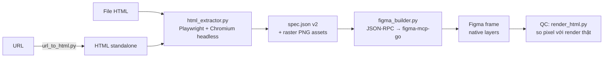

# HTML-To-Figma

**Pipeline tự động chuyển HTML/URL thành Figma design — pixel-perfect, layer editable, vận hành bởi AI agent qua MCP.**

Đưa vào 1 file HTML (hoặc URL trang web bất kỳ), nhận về 1 frame Figma với đầy đủ layer native (text, shape, effect chỉnh sửa được) + raster fallback cho phần Figma không vẽ nổi. Độ trung thực ~95%+ so với ảnh browser render thật.

## Demo — HTML render thật (trái) vs Figma build tự động (phải)

| Browser render | Figma build |
|---|---|
|  |  |
|  |  |

*Scene trên: numeral 3D dùng 15 lớp `text-shadow` → map thành stacked native DROP_SHADOW, text vẫn editable. Scene dưới: icon SVG raster hóa từng cái cô lập, text glow giữ native.*

## Pipeline



1. **Extract** — render HTML trong Chromium headless, đo từng element (layout, style, z-order, animation state), phân loại native/raster, xuất `spec.json` + PNG assets.
2. **Build** — dựng frame trên Figma desktop qua plugin [figma-mcp-go](https://github.com/xxjwxc/figma-mcp-go) (JSON-RPC/stdio), atomic rollback nếu lỗi giữa chừng.
3. **QC** — render lại HTML thành PNG tham chiếu bằng đúng logic freeze animation của extractor, so sánh pixel với screenshot Figma.

## Điểm kỹ thuật đáng nói

Cái khó của bài toán không phải "đọc CSS rồi vẽ lại" — mà là **trung thực với những gì browser thực sự render**, kể cả các case CSS/Figma hành xử ngược nhau:

- **Freeze animation tại "khoảnh khắc đỉnh"** — mỗi animation được seek tới keyframe có opacity cao nhất qua Web Animations API (không phải end-state, không phải fixed wait). Kèm fix race condition: WAAPI `pause()` là async, phải pause *trước* khi set `currentTime` nếu không kết quả trôi từng lần chạy.
- **Z-order kế thừa CSS stacking context** — effective z-index tính theo band của ancestor tạo stacking context, không phải z-index cục bộ từng element. Không có nó, background glow đè lên content.
- **Raster isolation** — mỗi element phức tạp được chụp *cô lập* (inject stylesheet tắt background/shadow của mọi ancestor, ẩn sibling), bbox tự nở theo ink-extent của glow/shadow (σ-based, không cắt cụt feather).
- **Map CSS → native Figma tối đa** — `text-shadow` nhiều lớp → stacked DROP_SHADOW, `filter: blur()/drop-shadow()` → LAYER_BLUR/DROP_SHADOW, gradient đơn giản → solid approximation; chỉ raster khi thật sự bất khả (conic gradient, clip-path, SVG).
- **Chống Figma frame-clipping** — Figma frame luôn clip children (figma-mcp-go không có API tắt), extractor có pass reparent riêng cho child tràn ra ngoài parent `overflow: visible`, kèm logic hướng z-bump khi thoát frame.
- **Lọc nhiễu trang trí** — swarm particle/dust hàng chục layer li ti được phát hiện structural (size cluster + keyword) và drop, kèm review-log closed-loop để mở rộng từ khóa an toàn.

## Vận hành bởi AI agent (Claude Code + MCP)

Repo này được thiết kế để một AI agent vận hành trọn vòng đời, không chỉ code hộ:

- **`CLAUDE.md` là runbook** — agent đọc và tự chạy pipeline 4 bước, có gate an toàn (vd phát hiện "ảnh thiết kế sẵn" thì dừng hỏi người dùng thay vì build vô nghĩa).
- **QC có kỷ luật** — chuẩn "đúng" là khớp ảnh browser render thật, không suy diễn design intent từ source; phát hiện lỗi thì báo cáo và *hỏi trước khi fix*.
- **Quy tắc fix-từ-gốc** — mọi bug đều truy root cause trong pipeline, mỗi fix kèm regression test (58 pytest tests).
- **Chống thối rữa** — `rot.md` là lịch bảo trì định kỳ từng lớp hệ thống (extractor, tests, dependencies, memory), agent tự kiểm tra mỗi phiên làm việc.

## Số liệu

- **58** pytest tests (synthetic + real-scene regression)
- **20+** scene thực tế đã build và QC bằng visual diff
- **~95%+** fidelity với các scene HTML/CSS sống; phần native giữ nguyên khả năng edit text/shape/effect trong Figma

## Tech stack

Python · Playwright (Chromium headless) · figma-mcp-go (MCP, JSON-RPC) · Claude Code (agentic workflow) · pytest

## Chạy thử

Yêu cầu: Python 3.11+, Figma desktop đang mở plugin **figma-mcp-go**.

```bash
python -m venv .venv && .venv/bin/pip install -r requirements.txt
.venv/bin/playwright install chromium

# Bước 1: HTML → spec
.venv/bin/python agents/html_extractor.py --input input/scene.html --output output/scene_spec.json

# Bước 2: spec → Figma
.venv/bin/python agents/figma_builder.py --spec output/scene_spec.json --report output/scene_report.json
```

Từ URL trang web: chạy thêm `agents/url_to_html.py --url <URL> --output input/scene.html` trước Bước 1.

## Giới hạn đã biết

- Gradient fill native chưa được figma-mcp-go hỗ trợ → gradient đơn giản xấp xỉ solid (có warning), gradient phức tạp raster.
- SVG raster hóa (không convert sang vector Figma).
- Scene animation đa pha (multi-beat timeline) hiện freeze về 1 khoảnh khắc — hướng multi-frame-per-phase đang trong backlog.
