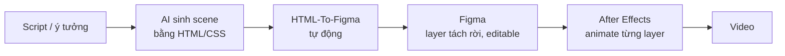
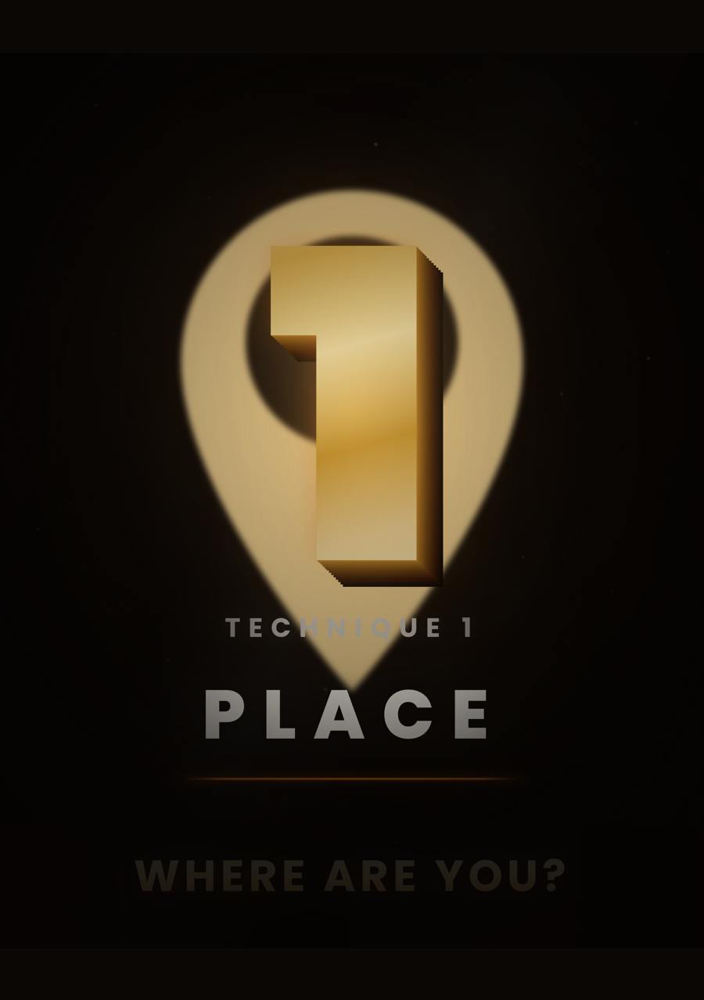
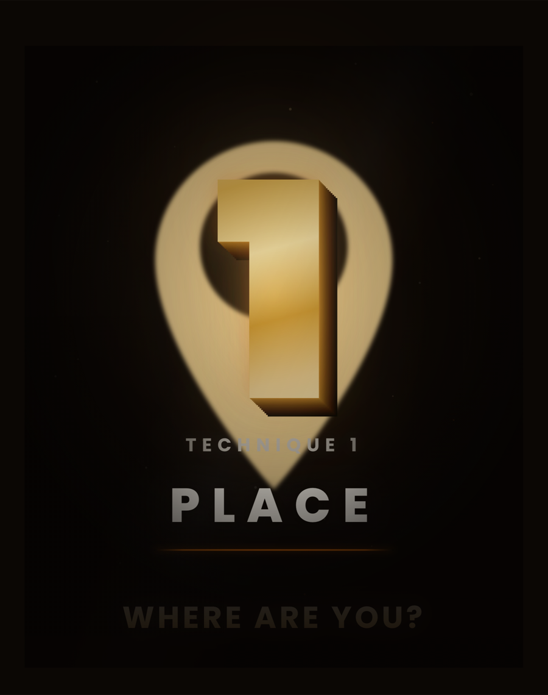
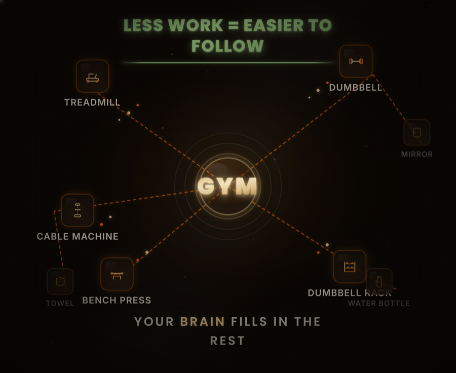
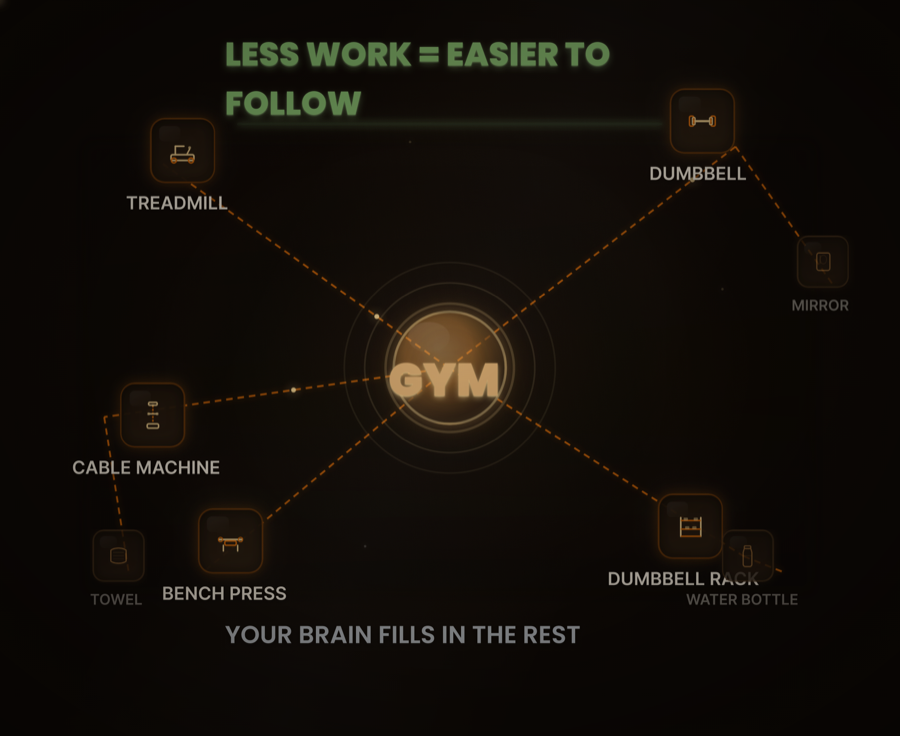

# HTML-To-Figma

**Công cụ cho editor / motion designer: biến scene thiết kế bằng HTML (thường do AI sinh ra) thành file Figma với layer tách rời — sẵn sàng đưa vào After Effects để dựng video.**

## Vấn đề nó giải quyết

AI hiện nay sinh design cực nhanh và đẹp bằng HTML/CSS — mỗi phân cảnh (scene) của video chỉ cần một prompt là có bản thiết kế hoàn chỉnh chạy trong browser. Nhưng editor không dựng video từ HTML: muốn animate được thì cần **từng layer tách rời** (chữ riêng, icon riêng, glow riêng, nền riêng) trong Figma / After Effects. Chép tay từng element từ browser vào Figma mất hàng giờ cho mỗi scene, và rất dễ sai màu, sai vị trí, sai hiệu ứng.

HTML-To-Figma tự động hóa đúng đoạn đó: đưa vào file HTML (hoặc URL), nhận về 1 frame Figma giống ảnh browser render ~95%+, mọi layer đã tách sẵn và đặt đúng chỗ.

## Nó nằm ở đâu trong quy trình dựng video



Bước **B → D** trước đây là thủ công (chép từng element) — giờ là 2 lệnh, vài phút mỗi scene, chạy được hàng loạt.

## Demo — browser render thật (trái) vs Figma build tự động (phải)

| Browser render | Figma build |
|---|---|
|  |  |
|  |  |

## Ra Figma rồi bạn nhận được gì

Mỗi tính năng bên dưới tồn tại vì một nhu cầu cụ thể khi dựng video:

- **Chữ và shape vẫn là layer native, không phải ảnh chết** — đổi nội dung text, sửa màu, chỉnh effect ngay trong Figma. Sang After Effects vẫn animate được từng chữ, từng icon.
- **Mỗi layer chỉ chứa pixel của chính nó** — icon glow được chụp cô lập, không dính nền hay layer bên dưới. Kéo sang AE là overlay lên video và animate độc lập được ngay, không phải xóa nền.
- **Scene có animation vẫn ra đúng khung hình đẹp nhất** — tool tự "đóng băng" mọi animation ở khoảnh khắc đỉnh của design (không phải frame đầu hay frame cuối ngẫu nhiên), nên frame Figma khớp với cái bạn thấy trong browser.
- **Outliner sạch** — bụi/particle trang trí (hàng chục layer li ti vô nghĩa với editor) được tự lọc bỏ, khỏi phải dọn tay.
- **Không tạo frame rác** — nếu trang chỉ là một tấm ảnh design bake sẵn (không phải HTML sống), tool dừng lại báo cho bạn kèm link ảnh gốc thay vì dựng một frame vô dụng.
- **Có thể giao trọn cho AI agent** — repo kèm runbook để Claude Code tự chạy cả pipeline: bạn đưa file/URL, agent extract, dựng frame, tự QC bằng cách so pixel với ảnh browser render thật rồi báo cáo.

## Từ Figma sang video

Frame Figma là "bản vẽ kỹ thuật" của scene: từ đây export từng layer (hoặc đưa thẳng sang After Effects qua plugin như Overlord), giữ nguyên vị trí và kích thước tương đối. Vì mỗi layer đã cô lập sẵn pixel của nó, việc dựng chỉ còn là gắn keyframe chuyển động — phần thiết kế đã xong từ khâu HTML.

## Cách dùng

Yêu cầu: Python 3.11+, Figma desktop đang mở plugin **figma-mcp-go**.

```bash
python -m venv .venv && .venv/bin/pip install -r requirements.txt
.venv/bin/playwright install chromium

# Bước 1: HTML → spec (tự đo đạc mọi element trong Chromium headless)
.venv/bin/python agents/html_extractor.py --input input/scene.html --output output/scene_spec.json

# Bước 2: spec → Figma (dựng frame qua figma-mcp-go)
.venv/bin/python agents/figma_builder.py --spec output/scene_spec.json --report output/scene_report.json
```

Có URL trang web thay vì file? Chạy thêm 1 lệnh trước Bước 1:

```bash
.venv/bin/python agents/url_to_html.py --url <URL> --output input/scene.html
```

## Số liệu

- **20+** scene video thực tế đã build và kiểm tra bằng visual diff với render thật
- **~95%+** độ trung thực; phần native giữ nguyên khả năng edit trong Figma
- **58** test tự động bảo vệ pipeline khỏi regression

## Giới hạn đã biết

- Gradient phức tạp (conic, nhiều lớp) và SVG được chuyển thành ảnh PNG chất lượng cao thay vì vector editable.
- Scene animation nhiều pha nối tiếp (kiểu "mini movie" 20-30 giây) hiện ra 1 khung hình duy nhất — hướng tách nhiều frame theo pha đang trong backlog.

## Tech stack

Python · Playwright (Chromium headless) · figma-mcp-go (MCP) · Claude Code (agentic workflow) · pytest
